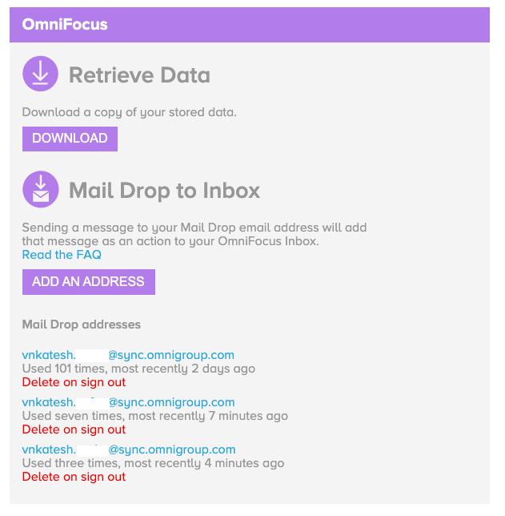
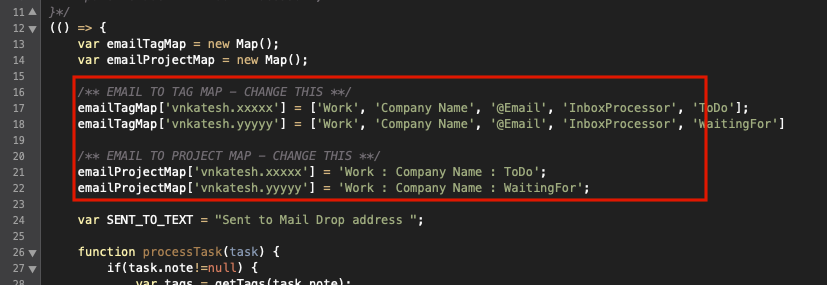
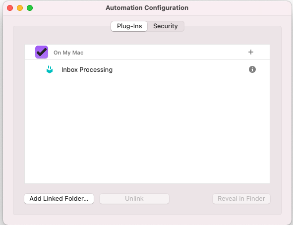
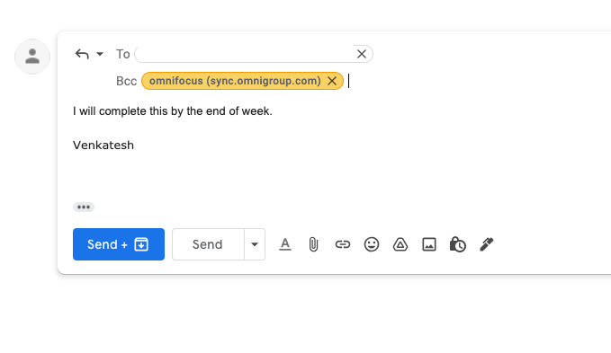
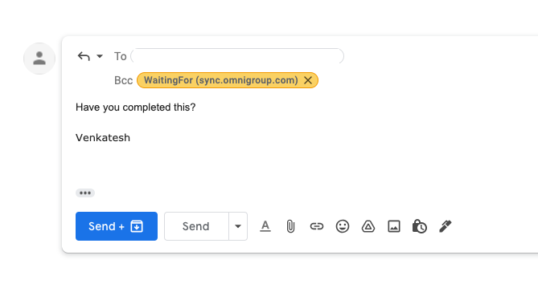
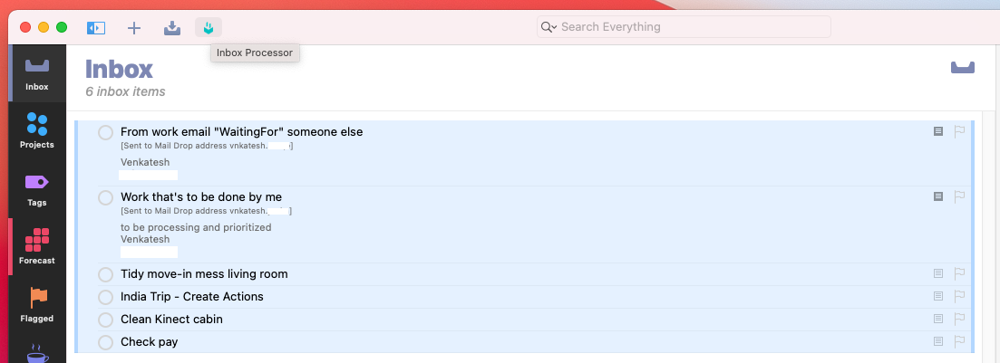
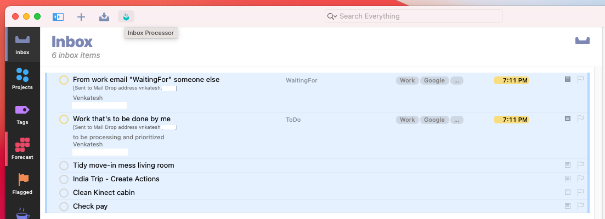

# OmniFocus Multi Mail Drop Processing
Process inbox tasks based on OF's multiple mail drop addressess.

**How I use it?**
* I've created multiple mail drop addressess via https://manage.sync.omnigroup.com/
* I've saved the email addressess as contacts in google GSuite. For e.g. as "WaitingFor" or "ToDo"
* Each email is specific for a single purpose. i.e personal email has it's own dedicated set of mail drop addressess.
* I bcc the contacts when I send/reply to emails
* The emails arrive in my OmniFocus Inbox
* I run this plugin
* The plugin adds projects, tags, 'due' to the inbox items based on the drop in email address it was sent to.
* I have additional custom perspectives to make life easier. 

### Caveats
Hackily written script, works for me.
Fork this code and do your own thing.
If there is enough interest - I might put in effort to generalize it [and make this readme better]
It also sets a +1 hour due date for all tasks.

### Setup
Setup multiple mail drop boxees:

Download the "Inbox Processing.omnijs" code.
Open with text editor and modify emailTagMap and emailProjectMap.
Ensure the tags/projects exist! [behavior without is not tested].

Now open the file with omnifocus and install it.

Optionally, add this to your customized omnifocus toolbar.
### Usage
Since I use GSuites for my company, I've saved my multiple mail drop boxes as different contacts.

E.g.

Once the emails reach my OF inbox, this is how it looks (expanded). 

Select all tasks -> Click on menubar "Inbox Processor" for the plugin to run. This is the after:

